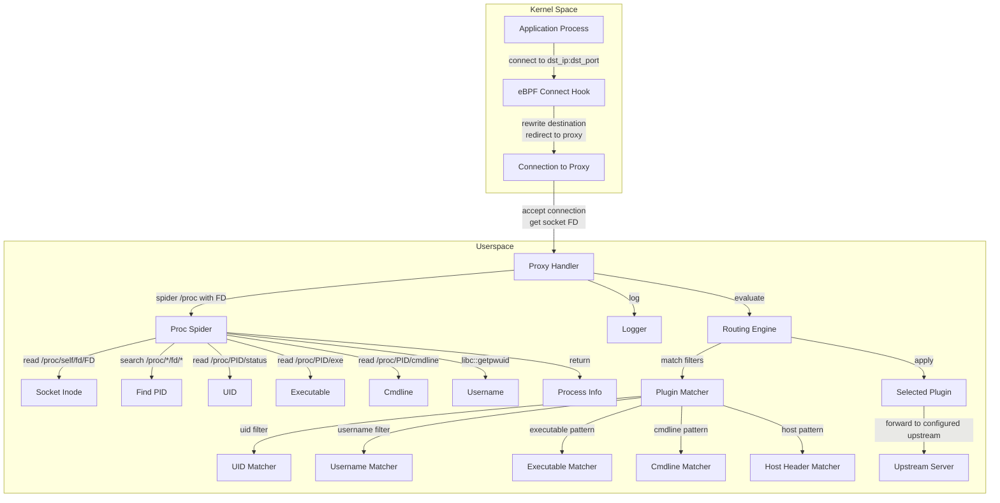

# Design Document: Process-Aware Routing

## Overview

This feature extends the existing eBPF-based transparent proxy to capture process metadata at connection time and enable routing decisions based on process identity. The system will identify which process initiated each connection (uid, username, pid, executable path, command line) using /proc filesystem spidering and make this information available to the userspace proxy for logging and routing.

The design introduces three major components:

1. **eBPF Connection Redirection**: The existing eBPF connect hook intercepts connections and redirects them to the proxy
2. **Proc Filesystem Spidering**: A userspace component that retrieves process metadata by reading /proc entries when connections are accepted
3. **Process-Aware Routing Engine**: Extends the proxy's plugin system to support filtering based on process attributes (uid, username, executable patterns, cmdline patterns) and HTTP Host headers

The system maintains backward compatibility - when process metadata is unavailable, the proxy continues to function with existing routing rules.

### Key Architectural Decision: Proc Spidering vs eBPF Maps

Initially, the design considered using eBPF maps to store process metadata captured in the kernel. However, this approach encountered significant challenges:

- **eBPF Verifier Complexity**: Capturing process metadata in eBPF (especially executable paths and command lines) requires complex pointer navigation that often fails eBPF verifier checks
- **Stack Limitations**: eBPF has strict stack size limits (512 bytes) that make it difficult to work with large data structures
- **Maintenance Burden**: eBPF code is harder to debug and maintain than userspace code

The implemented solution uses **proc filesystem spidering** instead:

1. When the proxy accepts a connection, it has access to the socket file descriptor
2. The proxy reads `/proc/self/fd/<fd>` to get the socket inode
3. The proxy searches `/proc/*/fd/*` to find which PID owns that socket inode
4. The proxy reads process metadata from `/proc/<pid>/` (status, exe, cmdline)
5. The proxy resolves the username using `libc::getpwuid()`

This approach:
- ✅ Avoids eBPF verifier complexity entirely
- ✅ Provides full access to all process metadata fields
- ✅ Is easier to debug and maintain
- ✅ Works reliably with CAP_SYS_PTRACE and CAP_DAC_READ_SEARCH capabilities
- ⚠️ Requires /proc filesystem access (standard on Linux)
- ⚠️ Slightly higher latency than eBPF maps (acceptable for HTTP proxy use case)

## Architecture

### High-Level Architecture



### Component Interaction Flow

1. **Connection Interception**: Application makes connect() syscall → eBPF hook intercepts
2. **Connection Redirect**: Connection redirected to local proxy (eBPF rewrites destination to proxy address)
3. **Connection Accept**: Proxy accepts connection and obtains socket file descriptor
4. **Proc Spidering**: Proxy calls Proc_Spider with socket FD
5. **Inode Extraction**: Proc_Spider reads /proc/self/fd/<FD> to get socket inode
6. **PID Discovery**: Proc_Spider searches /proc/*/fd/* to find which PID owns the socket
7. **Metadata Retrieval**: Proc_Spider reads /proc/<PID>/ for uid, exe, cmdline
8. **Username Resolution**: Proc_Spider resolves uid to username using libc::getpwuid()
9. **Logging**: Process metadata logged with request details
10. **Routing Evaluation**: Routing engine evaluates all configured filters
11. **Plugin Selection**: First matching plugin applied to request
12. **Request Forwarding**: Proxy forwards request to configured upstream target

### Proc Filesystem Spidering

The userspace component retrieves process metadata by reading /proc filesystem entries:

**Process Discovery Flow**:
1. **Socket FD → Inode**: Read `/proc/self/fd/<fd>` symlink to get `socket:[inode]`
2. **Inode → PID**: Search `/proc/*/fd/*` to find which PID has a symlink to `socket:[inode]`
3. **PID → UID**: Read `/proc/<pid>/status` and parse the `Uid:` line
4. **PID → Executable**: Read `/proc/<pid>/exe` symlink
5. **PID → Cmdline**: Read `/proc/<pid>/cmdline` (null-separated, convert to space-separated)
6. **UID → Username**: Call `libc::getpwuid(uid)` to resolve username

**Error Handling**:
- If socket inode cannot be extracted → return None
- If PID cannot be found → return None
- If /proc/<pid>/ entries cannot be read → use fallback values (empty strings, numeric uid)
- If username resolution fails → use numeric uid as fallback

**Performance Considerations**:
- Proc spidering adds ~1-5ms latency per connection (acceptable for HTTP proxy)
- The search through /proc/*/fd/* is the most expensive operation
- Could be optimized with caching if needed, but not required for MVP

**Required Capabilities**:
- `CAP_SYS_PTRACE`: Required to read /proc/<pid>/ entries for other users' processes
- `CAP_DAC_READ_SEARCH`: Required to bypass permission checks when reading /proc

### Configuration Schema Extensions

The `PluginConfig` structure will be extended to support process-aware routing:

```rust
#[derive(Debug, Clone, Serialize, Deserialize)]
pub struct PluginConfig {
    // Existing fields
    pub pattern: String,
    pub pattern_type: PatternType,
    pub response_source: ResponseSource,
    pub status_code: u16,
    pub timeout_secs: Option<u64>,
    
    // New process-aware routing fields
    pub uid: Option<u32>,
    pub username: Option<String>,
    pub executable_pattern: Option<PatternConfig>,
    pub cmdline_pattern: Option<PatternConfig>,
    pub host_pattern: Option<PatternConfig>,
    pub proxy_request_stdin: Option<bool>,
}

#[derive(Debug, Clone, Serialize, Deserialize)]
pub struct PatternConfig {
    pub pattern: String,
    pub pattern_type: PatternType,
}
```

The `ConnectionInterceptionConfig` will be introduced to support optional IP field:

```rust
#[derive(Debug, Clone, Serialize, Deserialize)]
pub struct ConnectionInterceptionConfig {
    pub ip: Option<String>,  // Optional target IP
    pub port: u16,           // Required target port
}
```

Example TOML configuration:

```toml
enable_ebpf = true
cgroup_path = "/sys/fs/cgroup"

[interception]
port = 80  # Intercept all traffic to port 80

[[plugins]]
pattern = "/api/*"
pattern_type = "glob"
uid = 1000
host_pattern = { pattern = "*.example.com", pattern_type = "glob" }
response_source = { type = "file", path = "/responses/api.json" }
status_code = 200

[[plugins]]
pattern = "/admin/*"
pattern_type = "glob"
username = "admin"
executable_pattern = { pattern = "/usr/bin/curl", pattern_type = "exact" }
response_source = { type = "command", command = "generate-admin-response", args = [] }
proxy_request_stdin = true  # Forward request with process metadata headers to command

[[plugins]]
pattern = "/dynamic/*"
pattern_type = "glob"
response_source = { type = "command", command = "process-aware-handler", args = [] }
proxy_request_stdin = true  # Inject X-Forwarded-* headers with process metadata
```

## Components and Interfaces

### 1. eBPF Connection Redirection Module

**Location**: `ebpf/src/main.rs` (existing)

**Responsibilities**:
- Intercept connect() syscalls for configured destinations
- Redirect connections to local proxy
- No process metadata capture (handled in userspace)

**Key Functions**:
```rust
// Existing eBPF hook (no changes needed for process metadata)
fn try_redirect_connect(ctx: SockAddrContext) -> Result<i32, ()> {
    // Existing redirect logic...
    // Check if destination matches configured target
    // Rewrite destination to proxy address
    Ok(1)
}
```

### 2. Userspace Process Metadata Retrieval

**Location**: `src/process/retriever.rs` (new module)

**Responsibilities**:
- Spider /proc filesystem to identify process from socket FD
- Retrieve process metadata (uid, pid, exe, cmdline)
- Resolve username from uid
- Provide metadata to logging and routing subsystems

**Interface**:
```rust
pub struct ProcessMetadataRetriever;

impl ProcessMetadataRetriever {
    pub fn new() -> Result<Self>;
    
    /// Retrieves process metadata for a connection using proc spidering
    /// Takes the socket file descriptor and returns process info
    pub fn get_metadata_from_fd(&self, fd: i32) -> Option<ProcessInfo>;
    
    /// Legacy interface using SocketAddr (returns None, use get_metadata_from_fd instead)
    pub fn get_metadata(&self, src_addr: &SocketAddr) -> Option<ProcessInfo>;
}

pub struct ProcessInfo {
    pub uid: u32,
    pub username: String,
    pub pid: u32,
    pub executable: String,
    pub cmdline: String,
}
```

**Implementation Details**:
```rust
// Helper functions (not public)
fn get_socket_inode(fd: i32) -> Option<u64>;
fn find_pid_by_socket_inode(inode: u64) -> Option<u32>;
fn read_proc_status_uid(pid: u32) -> Option<u32>;
fn read_proc_exe(pid: u32) -> String;
fn read_proc_cmdline(pid: u32) -> String;
fn resolve_username(uid: u32) -> String;
```

### 3. Pattern Matching Engine

**Location**: `src/plugin/matcher.rs` (new module)

**Responsibilities**:
- Evaluate exact, glob, and regex patterns
- Provide unified interface for all pattern types

**Interface**:
```rust
pub enum PatternMatcher {
    Exact(String),
    Glob(glob::Pattern),
    Regex(regex::Regex),
}

impl PatternMatcher {
    pub fn from_config(config: &PatternConfig) -> Result<Self>;
    
    pub fn matches(&self, input: &str) -> bool;
}
```

### 4. Process-Aware Routing Engine

**Location**: `src/plugin/process_aware.rs` (implemented), `src/plugin/factory.rs` (plugin creation)

**Responsibilities**:
- Wrap base plugins (FilePlugin, CommandPlugin) with process-aware filtering
- Evaluate all routing filters (uid, username, executable, cmdline, host)
- Apply AND logic for multiple filters
- Select first matching plugin via PluginRegistry

**Interface**:
```rust
pub struct PluginRegistry {
    plugins: Vec<Box<dyn InterceptionPlugin>>,
}

impl PluginRegistry {
    pub fn new(plugins: Vec<Box<dyn InterceptionPlugin>>) -> Self;
    
    pub fn find_match(
        &self,
        path: &str,
        process_info: Option<&ProcessInfo>,
        headers: &HashMap<String, String>,
    ) -> Option<&dyn InterceptionPlugin>;
    
    pub fn len(&self) -> usize;
}

pub struct ProcessAwarePlugin {
    base_plugin: Box<dyn InterceptionPlugin>,
    uid_filter: Option<u32>,
    username_filter: Option<String>,
    executable_matcher: Option<PatternMatcher>,
    cmdline_matcher: Option<PatternMatcher>,
    host_matcher: Option<PatternMatcher>,
}

impl ProcessAwarePlugin {
    pub fn new(
        base_plugin: Box<dyn InterceptionPlugin>,
        config: &PluginConfig,
    ) -> Result<Self>;
    
    fn matches_process_filters(
        &self,
        process_info: Option<&ProcessInfo>,
        headers: &HashMap<String, String>,
    ) -> bool;
}
```

**Note**: The routing engine is implemented through the `PluginRegistry` and `ProcessAwarePlugin` wrapper pattern. The `PluginFactory` automatically wraps plugins with `ProcessAwarePlugin` when process filters are configured.
```

### 5. Configuration Parser and Validator

**Location**: `src/config.rs` (extended)

**Responsibilities**:
- Parse process-aware routing configuration from TOML/YAML
- Validate pattern types and regex patterns
- Ensure required fields are present
- Validate proxy_request_stdin compatibility with response sources
- Validate PluginConfig fields (consolidated from separate module)

**Extensions**:
```rust
impl Config {
    pub fn validate(&self) -> Result<()> {
        // Existing validation...
        
        // Validate process-aware routing rules
        for plugin in &self.plugins {
            plugin.validate()?;
        }
        
        // Warn if process filters configured but eBPF disabled
        if !self.enable_ebpf && has_process_filters(&self.plugins) {
            warn!("Process-based routing rules configured but eBPF is disabled");
        }
        
        Ok(())
    }
}

impl PluginConfig {
    pub fn validate(&self) -> Result<()> {
        // Validate pattern configs have pattern_type
        // Validate regex patterns compile
        // Validate connection interception config has port
        // Validate proxy_request_stdin compatibility
        if let Some(true) = self.proxy_request_stdin {
            match &self.response_source {
                ResponseSource::Command { .. } => Ok(()),
                ResponseSource::File { .. } => {
                    Err(anyhow!("proxy_request_stdin can only be used with command-based response sources"))
                }
            }
        } else {
            Ok(())
        }
    }
    
    pub fn response_source_type(&self) -> &'static str {
        match &self.response_source {
            ResponseSource::File { .. } => "file",
            ResponseSource::Command { .. } => "command",
        }
    }
}
```

**Note**: Plugin configuration validation was consolidated from `src/plugin/config.rs` into `src/config.rs` during code cleanup to reduce module complexity.
```

### 6. Capability Checker

**Location**: `src/capability.rs` (existing module, extended)

**Responsibilities**:
- Check for CAP_SYS_PTRACE and CAP_DAC_READ_SEARCH at startup
- Check for eBPF-related capabilities (CAP_BPF, CAP_SYS_ADMIN, CAP_NET_ADMIN)
- Log warnings if capabilities are missing
- Allow graceful degradation

**Interface**:
```rust
pub struct CapabilityStatus {
    // eBPF operation capabilities
    pub has_bpf: bool,
    pub has_sys_admin: bool,
    pub has_net_admin: bool,
    
    // Process metadata capabilities
    pub has_sys_ptrace: bool,
    pub has_dac_read_search: bool,
}

pub fn check_capabilities() -> CapabilityStatus;
```

**Note**: During code cleanup, unused capability check methods (`has_ebpf_caps()`, `has_process_metadata_caps()`, `check_all_capabilities()`) were removed. Only the actively used `check_capabilities()` function remains.
```

### 7. LSM Hook for Ptrace Restriction

**Location**: `ebpf/src/lsm.rs` (new eBPF program)

**Responsibilities**:
- Restrict proxy process to read-only ptrace operations
- Block PTRACE_ATTACH mode
- Allow read-only access to /proc/pid/fd

**Implementation**:
```rust
#[lsm(hook = "ptrace_access_check")]
pub fn restrict_ptrace(ctx: LsmContext) -> i32 {
    // Get current pid
    // Check if it's the proxy process
    // If so, only allow read-only ptrace modes
    // Block PTRACE_ATTACH
}
```

This will be a separate eBPF program loaded alongside the connect hook.

### 8. Command Executor with HTTP Header Injection

**Location**: `src/plugin/command.rs` (existing module, extended)

**Responsibilities**:
- Execute command-based response sources
- Inject process metadata as HTTP headers when proxy_request_stdin is enabled
- Forward modified HTTP request to command stdin
- Handle cases where process metadata is unavailable

**Interface**:
```rust
pub struct CommandPlugin {
    config: PluginConfig,
    executable_matcher: Option<PatternMatcher>,
    cmdline_matcher: Option<PatternMatcher>,
    host_matcher: Option<PatternMatcher>,
}

impl CommandPlugin {
    pub fn new(config: PluginConfig) -> Result<Self>;
    
    async fn execute_command(
        &self,
        request_context: &RequestContext,
    ) -> Result<PluginResponse>;
    
    fn inject_process_headers(
        &self,
        headers: &mut HashMap<String, String>,
        process_info: &ProcessInfo,
    );
}
```

**Behavior**:
- When `proxy_request_stdin` is true and process metadata is available, inject all five X-Forwarded-* headers
- When `proxy_request_stdin` is true but process metadata is unavailable, forward the original request without injected headers
- When `proxy_request_stdin` is false or not specified, execute command without modifying the request
- Serialize the complete HTTP request (method, path, headers, body) and send to command stdin

**Note**: The command execution logic is integrated into the `CommandPlugin` struct rather than a separate `CommandExecutor` module for better cohesion.

## Data Models

### Process Info (Userspace)

```rust
#[derive(Debug, Clone)]
pub struct ProcessInfo {
    pub uid: u32,
    pub username: String,
    pub pid: u32,
    pub executable: String,
    pub cmdline: String,
}
```

Userspace representation with resolved username and proper String types. Created by the Proc_Spider after reading /proc filesystem entries.

### Pattern Config

```rust
#[derive(Debug, Clone, Serialize, Deserialize)]
pub struct PatternConfig {
    pub pattern: String,
    pub pattern_type: PatternType,
}
```

Used for executable_pattern, cmdline_pattern, and host_pattern filters.

### Connection Interception Config

```rust
#[derive(Debug, Clone, Serialize, Deserialize)]
pub struct ConnectionInterceptionConfig {
    pub ip: Option<String>,
    pub port: u16,
}
```

Replaces the current separate `target_address` and `target_port` fields to support optional IP.


## Correctness Properties

*A property is a characteristic or behavior that should hold true across all valid executions of a system-essentially, a formal statement about what the system should do. Properties serve as the bridge between human-readable specifications and machine-verifiable correctness guarantees.*

After analyzing all acceptance criteria and performing property reflection to eliminate redundancy, the following properties capture the essential correctness requirements:

### Property 1: Metadata Retrieval Round-Trip

*For any* connection accepted by the proxy with a valid socket file descriptor, if the proc spider successfully identifies the process, then the returned metadata should contain valid uid, pid, executable, and cmdline values.

**Validates: Requirements 1.1, 1.2, 1.3, 1.4, 1.5**

### Property 2: Proc Spidering Performance

*For any* sequence of metadata retrievals, the proc spidering operation should complete within a reasonable time bound (e.g., < 10ms) to avoid blocking request processing.

**Validates: Requirements 1.7 (graceful handling)**

### Property 3: Graceful Degradation Without Metadata

*For any* request where process metadata is not available in the cache, the proxy should continue processing the request successfully without crashing or returning errors.

**Validates: Requirements 3.3, 4.7**

### Property 4: Process Metadata Logging Completeness

*For any* request with available process metadata, the log output should contain all five metadata fields: uid, username, pid, executable path, and command line arguments.

**Validates: Requirements 4.1, 4.2, 4.3, 4.4, 4.5, 4.6**

Note: This combines the individual logging requirements into a single comprehensive property since they all test the same behavior (completeness of logging).

### Property 5: No Process Filters Matches All

*For any* routing rule with no process-based filters configured, the rule should match requests based only on existing criteria (URL pattern) regardless of whether process metadata is available.

**Validates: Requirements 5.6**

### Property 6: Multiple Filters Use AND Logic

*For any* routing rule with multiple process-based filters specified, the rule should match only when all specified filters match (AND logic), and should not match if any single filter fails.

**Validates: Requirements 5.7, 11.2, 11.3**

Note: This combines requirements about AND logic into a single property.

### Property 7: UID Filter Matching

*For any* process metadata with a uid value, a routing rule with a matching uid filter should consider the rule as matching, and a rule with a non-matching uid filter should skip the rule.

**Validates: Requirements 6.2, 6.3**

### Property 8: UID Filter Requires Metadata

*For any* request without process metadata, routing rules with uid filters should not match.

**Validates: Requirements 6.4**

### Property 9: Username Filter Matching

*For any* process metadata with a username value, a routing rule with a matching username filter should consider the rule as matching, and a rule with a non-matching username filter should skip the rule.

**Validates: Requirements 7.2, 7.3**

### Property 10: Username Filter Requires Metadata

*For any* request without process metadata, routing rules with username filters should not match.

**Validates: Requirements 7.4**

### Property 11: Pattern Matching Correctness

*For any* pattern matcher (exact, glob, or regex) and any input string, the matcher should correctly identify whether the input matches the pattern according to the pattern type semantics.

**Validates: Requirements 8.2, 8.3, 8.4, 9.2, 9.3, 9.4, 10.2, 10.3, 10.4**

Note: This combines all pattern matching requirements (executable, cmdline, host) into a single property since they all use the same pattern matching engine.

### Property 12: Executable Pattern Filter Requires Metadata

*For any* request without process metadata, routing rules with executable_pattern filters should not match.

**Validates: Requirements 8.7**

### Property 13: Cmdline Pattern Filter Requires Metadata

*For any* request without process metadata, routing rules with cmdline_pattern filters should not match.

**Validates: Requirements 9.7**

### Property 14: Host Pattern Filter Requires Header

*For any* request without a Host header, routing rules with host_pattern filters should not match.

**Validates: Requirements 10.7**

### Property 15: Filter Combination Support

*For any* valid combination of uid, username, executable_pattern, cmdline_pattern, and host_pattern filters, the routing engine should correctly evaluate all filters and apply AND logic.

**Validates: Requirements 11.4**

### Property 16: Configuration Round-Trip

*For any* valid PluginConfig object with process filters, serializing to TOML or YAML and then parsing back should produce an equivalent configuration object.

**Validates: Requirements 12.12, 12.13, 12.14**

Note: This is a standard round-trip property for configuration serialization.

### Property 17: Invalid Configuration Rejection

*For any* configuration with invalid filter specifications (missing pattern_type, invalid regex, missing required fields), the config parser or validator should return a descriptive error.

**Validates: Requirements 12.11, 14.1, 14.2, 14.3, 14.4, 14.6**

Note: This combines all validation error requirements into a single property.

### Property 18: eBPF Disabled Skips Process Filters

*For any* request when enable_ebpf is false, routing rules with any process-based filters (uid, username, executable_pattern, cmdline_pattern) should not match.

**Validates: Requirements 13.2**

### Property 19: Optional IP Intercepts All Ports

*For any* connection to the configured port when the IP field is not specified in the interception config, the eBPF hook should intercept the connection regardless of the destination IP address.

**Validates: Requirements 15.3**

### Property 20: Specified IP Intercepts Only Matching

*For any* connection when the IP field is specified in the interception config, the eBPF hook should intercept only connections to the exact (IP, port) pair and not intercept connections to other IPs on the same port.

**Validates: Requirements 15.4**

### Property 21: Host Pattern Works Without IP Filter

*For any* request when the IP field is not specified in interception config and a host_pattern filter is configured, the routing engine should evaluate the Host header to determine rule matching.

**Validates: Requirements 15.5**

### Property 22: Graceful Capability Degradation

*For any* system startup with missing capabilities (CAP_SYS_PTRACE or CAP_DAC_READ_SEARCH), the system should continue initialization and attempt to capture available process metadata fields without crashing.

**Validates: Requirements 16.6, 16.7**

### Property 23: LSM Hook Blocks Logged

*For any* ptrace operation blocked by the LSM hook, a log entry should be created containing the target pid and operation type.

**Validates: Requirements 17.6**

### Property 24: LSM Hook Scoped to Proxy

*For any* process other than the proxy process, the LSM hook restrictions should not apply, and ptrace operations should behave normally.

**Validates: Requirements 17.7**

### Property 25: Metadata Retrieval Failure Handling

*For any* connection where proc spidering fails to retrieve metadata (socket inode not found, PID not found, /proc read failure), the system should return None and continue processing without crashing.

**Validates: Requirements 1.7**

### Property 30: Socket Inode to PID Mapping

*For any* valid socket file descriptor, if a process owns that socket, then searching /proc/*/fd/* for the socket inode should successfully identify the owning PID.

**Validates: Requirements 1.1, 1.2, 3.1, 3.2**

## Error Handling

### Proc Spidering Errors

The proc spidering component must handle failures gracefully:

- **Socket inode extraction failure**: If `/proc/self/fd/<fd>` cannot be read or doesn't contain a socket inode, return None
- **PID discovery failure**: If no PID is found owning the socket inode, return None (connection may have closed)
- **Permission denied**: If /proc/<pid>/ entries cannot be read due to permissions, return None or partial metadata
- **Invalid UTF-8**: If executable path or cmdline contains invalid UTF-8, use lossy conversion
- **Username resolution failure**: If `libc::getpwuid()` fails, use the numeric uid as a fallback

All failures should be logged at debug level and should not prevent request processing.

### Userspace Retrieval Errors

When retrieving process metadata:

- **Metadata unavailable**: If proc spidering returns None, continue processing without metadata
- **Username resolution failure**: If uid-to-username lookup fails, use the numeric uid as a fallback
- **Invalid UTF-8**: If executable path or cmdline contains invalid UTF-8, use lossy conversion

### Configuration Errors

Configuration validation should catch errors early:

- **Missing pattern_type**: Return error indicating which plugin and field is missing pattern_type
- **Invalid regex**: Return error with regex compilation error message
- **Missing port**: Return error indicating connection interception config requires port field
- **File not found**: Return error if response_source file doesn't exist
- **Invalid proxy_request_stdin**: Return error if proxy_request_stdin is true with a file-based response source

All configuration errors should prevent startup with clear error messages.

### Routing Errors

During request routing:

- **No matching plugin**: If no plugin matches, forward request to upstream target
- **Pattern compilation failure**: Log error and skip the rule (should be caught during validation)
- **Missing Host header**: Skip rules with host_pattern filters

### Command Execution Errors

When executing command-based response sources with proxy_request_stdin:

- **Header serialization failure**: If process metadata contains invalid header values, use lossy conversion or skip the problematic header
- **Command stdin write failure**: Log error and return 502 Bad Gateway response
- **Missing process metadata**: Forward original request without injected headers (graceful degradation)
- **Command execution failure**: Return appropriate error response based on command exit code

### LSM Hook Errors

The LSM hook should handle errors defensively:

- **PID lookup failure**: Allow the operation (fail open for safety)
- **Invalid operation type**: Allow the operation
- **Logging failure**: Continue blocking the operation even if logging fails

## Testing Strategy

This feature requires a dual testing approach combining unit tests and property-based tests:

### Unit Testing

Unit tests will focus on:

- **Configuration parsing examples**: Test parsing TOML/YAML configs with various filter combinations including proxy_request_stdin (Requirements 5.1-5.5, 12.1-12.10, 15.1, 15.2, 15.6, 15.7, 18.1)
- **Configuration validation**: Test that proxy_request_stdin with file-based sources returns errors (Requirement 18.3)
- **Capability check logging**: Test that appropriate warnings/confirmations are logged based on capability availability (Requirements 13.3, 16.3, 16.4, 16.5)
- **LSM hook specific behaviors**: Test that PTRACE_ATTACH is blocked, read-only ptrace is allowed, /proc access works, and memory modification is blocked (Requirements 17.2, 17.3, 17.4, 17.5)
- **Header injection examples**: Test that specific requests with metadata get the correct headers injected (Requirements 18.4-18.8)
- **Edge cases**: Test empty metadata fields, missing Host headers, eBPF disabled scenarios, proxy_request_stdin without metadata
- **Integration points**: Test eBPF-to-userspace cache access, username resolution, pattern matcher initialization, command executor with stdin forwarding

### Property-Based Testing

Property-based tests will verify universal properties across randomized inputs using the `proptest` crate for Rust. Each test should run a minimum of 100 iterations.

**Test Configuration**:
```rust
use proptest::prelude::*;

proptest! {
    #![proptest_config(ProptestConfig::with_cases(100))]
    
    #[test]
    fn property_name(/* generated inputs */) {
        // Test implementation
    }
}
```

**Property Test Coverage**:

1. **Property 1 (Metadata Round-Trip)**: Generate random connection tuples and metadata, store in cache, verify retrieval
   - Tag: **Feature: process-aware-routing, Property 1: Metadata capture round-trip**

2. **Property 2 (LRU Eviction)**: Generate sequences of insertions exceeding cache size, verify LRU eviction and size limits
   - Tag: **Feature: process-aware-routing, Property 2: LRU eviction behavior**

3. **Property 3 (Graceful Degradation)**: Generate random requests without metadata, verify successful processing
   - Tag: **Feature: process-aware-routing, Property 3: Graceful degradation without metadata**

4. **Property 4 (Logging Completeness)**: Generate random metadata, verify all fields appear in logs
   - Tag: **Feature: process-aware-routing, Property 4: Process metadata logging completeness**

5. **Property 5 (No Filters Match All)**: Generate random requests and rules without process filters, verify matching
   - Tag: **Feature: process-aware-routing, Property 5: No process filters matches all**

6. **Property 6 (AND Logic)**: Generate random filter combinations, verify AND logic
   - Tag: **Feature: process-aware-routing, Property 6: Multiple filters use AND logic**

7. **Property 7 (UID Matching)**: Generate random uids and filters, verify matching logic
   - Tag: **Feature: process-aware-routing, Property 7: UID filter matching**

8. **Property 8 (UID Requires Metadata)**: Generate requests without metadata, verify uid filters don't match
   - Tag: **Feature: process-aware-routing, Property 8: UID filter requires metadata**

9. **Property 9 (Username Matching)**: Generate random usernames and filters, verify matching logic
   - Tag: **Feature: process-aware-routing, Property 9: Username filter matching**

10. **Property 10 (Username Requires Metadata)**: Generate requests without metadata, verify username filters don't match
    - Tag: **Feature: process-aware-routing, Property 10: Username filter requires metadata**

11. **Property 11 (Pattern Matching)**: Generate random patterns (exact, glob, regex) and inputs, verify correct matching
    - Tag: **Feature: process-aware-routing, Property 11: Pattern matching correctness**

12. **Property 12 (Executable Requires Metadata)**: Generate requests without metadata, verify executable filters don't match
    - Tag: **Feature: process-aware-routing, Property 12: Executable pattern filter requires metadata**

13. **Property 13 (Cmdline Requires Metadata)**: Generate requests without metadata, verify cmdline filters don't match
    - Tag: **Feature: process-aware-routing, Property 13: Cmdline pattern filter requires metadata**

14. **Property 14 (Host Requires Header)**: Generate requests without Host header, verify host filters don't match
    - Tag: **Feature: process-aware-routing, Property 14: Host pattern filter requires header**

15. **Property 15 (Filter Combinations)**: Generate random valid filter combinations, verify correct evaluation
    - Tag: **Feature: process-aware-routing, Property 15: Filter combination support**

16. **Property 16 (Config Round-Trip)**: Generate random PluginConfig objects, verify serialization round-trip
    - Tag: **Feature: process-aware-routing, Property 16: Configuration round-trip**

17. **Property 17 (Invalid Config Rejection)**: Generate invalid configurations, verify descriptive errors
    - Tag: **Feature: process-aware-routing, Property 17: Invalid configuration rejection**

18. **Property 18 (eBPF Disabled)**: Generate requests with eBPF disabled, verify process filters don't match
    - Tag: **Feature: process-aware-routing, Property 18: eBPF disabled skips process filters**

19. **Property 19 (Optional IP All Ports)**: Generate connections to various IPs on configured port, verify all intercepted
    - Tag: **Feature: process-aware-routing, Property 19: Optional IP intercepts all ports**

20. **Property 20 (Specified IP Only)**: Generate connections to various IPs, verify only matching IP intercepted
    - Tag: **Feature: process-aware-routing, Property 20: Specified IP intercepts only matching**

21. **Property 21 (Host Without IP)**: Generate requests with various Host headers, verify pattern matching works
    - Tag: **Feature: process-aware-routing, Property 21: Host pattern works without IP filter**

22. **Property 22 (Capability Degradation)**: Test startup with missing capabilities, verify graceful continuation
    - Tag: **Feature: process-aware-routing, Property 22: Graceful capability degradation**

23. **Property 23 (LSM Logging)**: Generate blocked ptrace operations, verify logging
    - Tag: **Feature: process-aware-routing, Property 23: LSM hook blocks logged**

24. **Property 24 (LSM Scoping)**: Test ptrace from non-proxy processes, verify no restrictions
    - Tag: **Feature: process-aware-routing, Property 24: LSM hook scoped to proxy**

25. **Property 25 (Metadata Failure Handling)**: Simulate metadata retrieval failures, verify graceful handling
    - Tag: **Feature: process-aware-routing, Property 25: Metadata retrieval failure handling**

26. **Property 26 (Proxy Request Stdin Validation)**: Generate configs with proxy_request_stdin=true and file-based sources, verify validation errors
    - Tag: **Feature: process-aware-routing, Property 26: Proxy request stdin validation**

27. **Property 27 (Header Injection)**: Generate random requests with metadata and proxy_request_stdin enabled, verify all five headers injected
    - Tag: **Feature: process-aware-routing, Property 27: Process metadata header injection**

28. **Property 28 (No Header Injection)**: Generate requests with proxy_request_stdin disabled, verify no headers injected
    - Tag: **Feature: process-aware-routing, Property 28: No header injection when disabled**

29. **Property 29 (Graceful Without Metadata)**: Generate requests without metadata but proxy_request_stdin enabled, verify original request forwarded
    - Tag: **Feature: process-aware-routing, Property 29: Graceful header injection without metadata**

30. **Property 30 (Destination Retrieval)**: Generate random connection tuples with destinations, store in cache, verify proxy can retrieve original destination from source IP/port
    - Tag: **Feature: process-aware-routing, Property 30: Destination IP retrieval from cache**

### Test Dependencies

- **proptest**: For property-based testing with random input generation
- **glob**: For glob pattern matching
- **regex**: For regex pattern matching
- **aya**: For eBPF map access in tests
- **tempfile**: For temporary config file testing
- **test-log**: For capturing and asserting log output

### Testing Challenges

1. **eBPF Testing**: eBPF programs are difficult to unit test. We'll focus on integration tests that load the actual eBPF program and verify behavior end-to-end.

2. **Capability Testing**: Testing capability checks requires running tests with different capability sets, which may require privileged test execution or mocking.

3. **LSM Hook Testing**: LSM hooks require kernel support and may not be testable in all environments. We'll provide integration tests that can be run on systems with LSM support.

4. **Username Resolution**: Tests should mock or stub username resolution to avoid dependencies on system user databases.

5. **Randomized Testing**: Property-based tests with 100+ iterations may be slower than unit tests. We'll ensure they can be run selectively during development.

## Code Organization and Refactoring

### Module Structure

The implementation follows a clean module structure:

```
src/
├── capability.rs          # Capability checking (eBPF + process metadata)
├── config.rs              # Configuration parsing and validation (consolidated)
├── error.rs               # Error types
├── lib.rs                 # Library root
├── logging.rs             # Logging configuration
├── main.rs                # Binary entry point
├── metrics.rs             # Prometheus metrics
├── plugin/
│   ├── command.rs         # Command-based plugins with header injection
│   ├── factory.rs         # Plugin creation and registry
│   ├── file.rs            # File-based plugins
│   ├── matcher.rs         # Pattern matching (exact/glob/regex)
│   ├── mod.rs             # Plugin trait and types
│   └── process_aware.rs   # Process-aware plugin wrapper
├── process/
│   ├── mod.rs             # ProcessInfo type definition
│   └── retriever.rs       # Proc filesystem spidering
├── proxy/
│   ├── handler.rs         # HTTP request handler
│   ├── mod.rs             # Proxy server
│   └── socket_fd_layer.rs # Socket FD extraction layer
├── redirect/
│   ├── ebpf.rs            # eBPF program loading and management
│   └── mod.rs             # Redirect mode abstraction
└── upstream/
    ├── client.rs          # Upstream HTTP client
    └── mod.rs             # Upstream module re-exports

ebpf/src/
├── lib.rs                 # eBPF shared types
├── lsm.rs                 # LSM ptrace restriction hook
└── main.rs                # eBPF connect hook
```

### Code Cleanup (Phase 9)

During implementation, the following cleanup and refactoring was performed:

**Task 26: Remove Unused Code**
- Removed unused capability check methods: `has_ebpf_caps()`, `has_process_metadata_caps()`, `check_all_capabilities()`
- Removed unused error methods: `is_retryable()`, `is_config_error()`
- Removed unused logging function: `init_default_logging()`
- Removed unused upstream client method: `request()` (kept `proxy_request_full()`)
- Cleaned up unused imports across multiple files

**Task 27: Simplify RedirectMode Abstraction**
- Removed `RedirectMode::Noop` variant (eBPF is now mandatory)
- Kept enum structure for future extensibility
- Updated tests to use `#[ignore]` for eBPF-dependent tests

**Task 28: Consolidate Plugin Configuration**
- Moved `PluginConfig::validate()` from `src/plugin/config.rs` to `src/config.rs`
- Moved `PluginConfig::response_source_type()` to `src/config.rs`
- Deleted `src/plugin/config.rs` module entirely
- Moved all 9 plugin configuration tests to `src/config.rs`
- Reduced module count and improved code organization

**Task 29: Clean Up Process Retriever**
- Removed `_placeholder: ()` field from `ProcessMetadataRetriever`
- Added conditional compilation attributes to fix warnings on non-Linux platforms
- Added `#[cfg_attr(not(target_os = "linux"), allow(dead_code, unused_variables))]` to Linux-only functions
- Conditionally imported `ProcessInfo`, `HashMap`, `fs`, and `RwLock` only on Linux
- Evaluated cache structure (kept `RwLock<HashMap>` as appropriate for concurrent access)

**Task 30: Evaluate Module Structure**
- Evaluated `src/upstream/mod.rs` - kept as-is (client.rs is substantial at 270+ lines)
- Evaluated `src/process/mod.rs` - kept as-is (structure is well-organized)

**Task 31: Final Cleanup Verification**
- Ran `cargo clippy -- -W clippy::all -W clippy::pedantic`
- Fixed all unused imports, variables, and dead code warnings
- Reduced clippy warnings from 146 to 6 minor pedantic warnings
- Verified no unused dependencies
- All 71 tests passing, 2 ignored (eBPF-dependent)
- Binary size: 4.9M (native macOS), 7.2M (Linux musl with static linking)

### Design Principles

The implementation follows these key principles:

1. **Separation of Concerns**: Each module has a clear, focused responsibility
2. **Graceful Degradation**: System continues functioning when process metadata is unavailable
3. **Backward Compatibility**: Existing routing rules work without modification
4. **Testability**: Components are designed for unit testing and property-based testing
5. **Error Handling**: All error paths are handled explicitly with appropriate logging
6. **Performance**: Proc spidering adds minimal latency (~1-5ms) acceptable for HTTP proxy use case
7. **Security**: LSM hooks restrict proxy process to read-only operations
8. **Maintainability**: Code is well-documented with clear interfaces and minimal complexity
